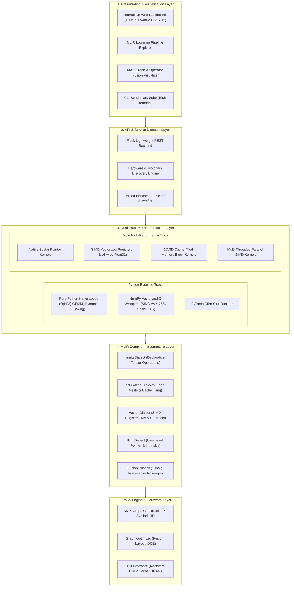

# AI Compiler & Kernel Playground - System Architecture

This document details the architectural design, compilation pipeline, execution layers, and data flow of the **AI Compiler & Kernel Playground**.

---

## 1. High-Level System Architecture

The playground implements a modular, 5-tier architecture connecting high-level neural network code with low-level hardware execution.



---

## 2. Layer-by-Layer Breakdown

### Layer 1: Presentation & Interactive Explorer
- **Interactive Playground (`frontend/`)**: Configures input tensor dimensions ($N=10^5 \dots 10^7$, Matrix $64 \times 64 \dots 512 \times 512$), executes live benchmarks, visualizes execution times on logarithmic bar charts, and checks numerical correctness ($c_i = \text{ref}_i$).
- **MLIR Visualizer**: Explains lowering transformations across 6 progressive stages (`source` $\to$ `linalg` $\to$ `scf` $\to$ `vector` $\to$ `llvm` $\to$ `assembly`).
- **MAX Graph Inspector**: Displays before-and-after operator fusion pipelines and quantifies DRAM memory traffic reductions.

### Layer 2: API & Dispatch Engine (`backend/`)
- **`app.py`**: Minimal REST API providing endpoints for environment discovery (`/api/environment`), experiment catalog (`/api/experiments`), execution runner (`/api/run`), MLIR pipeline metadata (`/api/mlir-pipeline`), and MAX graphs (`/api/max-graph`).
- **`environment.py`**: Auto-detects CPU model, physical/logical core counts, SIMD vector widths, Python versions, and Mojo/MAX installations.
- **`runner.py`**: Manages warmup passes, timing loops ($K$ repetitions), median latency calculations, GFLOPS estimation, and memory bandwidth (GB/s).

### Layer 3: Kernel Implementation Tracks
- **Python Track (`python/`)**: Serves as the experimental baseline. Demonstrates the performance costs of interpreted bytecode, dynamic type dispatch, and pointer chasing in pure Python.
- **Mojo Track (`mojo/`)**: Implements hardware-tuned kernels using Mojo's zero-cost systems abstractions (`SIMD`, `UnsafePointer`, `parallelize`, and cache tiling).

### Layer 4: MLIR Compiler Dialect Hierarchy (`mlir/`)
Shows the multi-stage lowering process from mathematical tensor operations to machine code:
1. `linalg.matmul` / `linalg.generic`: High-level domain representation.
2. `scf.for` / `affine.for`: Structured loops with cache tiling parameters ($64 \times 64$).
3. `vector.transfer_read` / `vector.contract`: SIMD register allocation and hardware Fused-Multiply-Add (FMA).
4. `llvm.load` / `llvm.fadd` / `llvm.store`: Direct machine pointer instructions.

### Layer 5: MAX Engine Runtime & Hardware Execution (`max/`)
- Demonstrates how the Modular Accelerated eXecution (MAX) engine optimizes computational graphs by eliminating intermediate tensor allocations in DRAM, keeping data resident in CPU L1/L2 cache and vector registers.

---

## 3. Data Flow During an Experiment Run

```text
User selects [Matrix Multiplication 256x256] in UI
                   │
                   ▼
Frontend issues POST /api/run { experiment: "matrix_multiply", params: { n: 256 } }
                   │
                   ▼
Runner initializes input matrices A, B in memory
                   │
         ┌─────────┴─────────┐
         ▼                   ▼
Run Python Baselines    Run Mojo / Hardware Kernels
(Naive i-j-k, NumPy)   (SIMD, 2D Tiled, Parallel)
         │                   │
         └─────────┬─────────┘
                   ▼
Numerical Verification: np.allclose(result, reference, atol=1e-3)
                   │
                   ▼
Metrics Computed: Latency (ms), GFLOPS (2*N^3 / time), Speedup Factor
                   │
                   ▼
JSON Response sent to UI -> Bar Chart & KPI Cards animated
```
