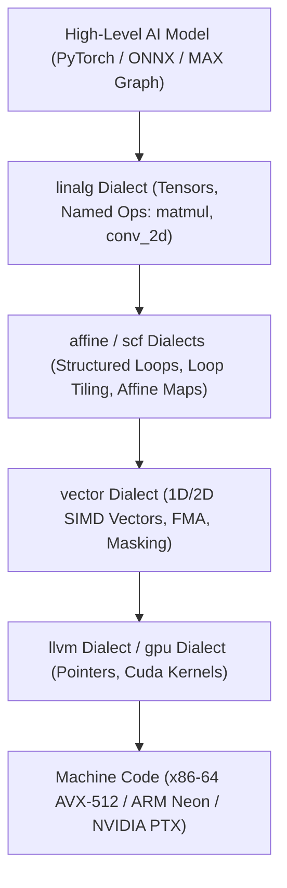

# MLIR (Multi-Level Intermediate Representation) - Complete Pedagogical Guide

This guide explains how modern AI compilers use **MLIR** to translate high-level neural networks into optimal machine instructions.

---

## 1. Why MLIR? The Problem with Traditional Compilers

Traditional compilers like **LLVM** were built around a single, fixed intermediate representation (**LLVM IR**). While LLVM IR is exceptional for low-level optimizations (dead code elimination, register allocation, instruction scheduling), it has major limitations for AI workloads:

1. **Loss of High-Level Semantics**: LLVM IR only understands flat memory addresses, pointers, and scalar types. When a 4D tensor convolution or matrix multiplication is lowered directly to LLVM IR, the compiler loses the multidimensional shape and loop nesting structure.
2. **Hard to Perform Polyhedral & Tiling Transformations**: Optimizations like cache tiling ($64 \times 64$ blocks) and operator fusion are complex and fragile to perform on raw pointer arithmetic.
3. **Hardware Diversity**: Modern AI runs on CPUs, GPUs, TPUs, NPUs, and custom accelerators. A single fixed IR cannot represent all hardware features without becoming cluttered.

**MLIR solves this by introducing hierarchical Dialects.**

---

## 2. The Dialect Hierarchy

An MLIR **Dialect** is a self-contained namespace of operations, types, and attributes representing a specific level of abstraction.



### Core MLIR Dialects in AI Compilers

| Dialect | Abstraction Level | Primary Responsibility | Example Operations |
| :--- | :--- | :--- | :--- |
| **`linalg`** | High Level (Tensors/Memrefs) | Structured linear algebra algorithms without hardcoded loops | `linalg.matmul`, `linalg.generic`, `linalg.yield` |
| **`affine`** | Loop Transformation | Polyhedral analysis, loop unrolling, and multi-level loop tiling | `affine.for`, `affine.load`, `affine_map` |
| **`scf`** | Structured Control Flow | Explicit structured loops, conditionals, and iterators | `scf.for`, `scf.if`, `scf.yield` |
| **`vector`** | Hardware SIMD | Fixed-width vector registers and fused operations | `vector.transfer_read`, `vector.contract`, `vector.reduction` |
| **`arith` / `math`** | Scalar/Vector Math | Basic arithmetic, transcendental functions, and logic | `arith.addf`, `arith.mulf`, `math.tanh` |
| **`llvm`** | Machine-Level IR | 1:1 mapping to LLVM instructions and pointer arithmetic | `llvm.load`, `llvm.fadd`, `llvm.ptr` |

---

## 3. Step-by-Step Lowering Walkthrough: Matrix Multiplication

Let us trace how a Matrix Multiplication ($C = A \times B$) is lowered step-by-step through MLIR passes.

### Step 1: `linalg.matmul` (Declarative Tensor Form)
```mlir
func.func @matmul(%A: tensor<512x512xf32>, %B: tensor<512x512xf32>, %C: tensor<512x512xf32>) -> tensor<512x512xf32> {
  %res = linalg.matmul
    ins(%A, %B : tensor<512x512xf32>, tensor<512x512xf32>)
    outs(%C : tensor<512x512xf32>) -> tensor<512x512xf32>
  return %res : tensor<512x512xf32>
}
```
*Purpose*: Informs the compiler that this is a standard GEMM without forcing an iteration order.

---

### Step 2: Cache-Aware Loop Tiling (`--linalg-tile`)
**Compiler Pass**: `mlir-opt --linalg-tile="tile-sizes=64,64,64"`
```mlir
scf.for %i_tile = %c0 to %c512 step %c64 {
  scf.for %j_tile = %c0 to %c512 step %c64 {
    scf.for %k_tile = %c0 to %c512 step %c64 {
      %sub_a = memref.subview %A[%i_tile, %k_tile] [64, 64] [1, 1] : memref<512x512xf32> to memref<64x64xf32>
      %sub_b = memref.subview %B[%k_tile, %j_tile] [64, 64] [1, 1] : memref<512x512xf32> to memref<64x64xf32>
      %sub_c = memref.subview %C[%i_tile, %j_tile] [64, 64] [1, 1] : memref<512x512xf32> to memref<64x64xf32>
      linalg.matmul ins(%sub_a, %sub_b) outs(%sub_c)
    }
  }
}
```
*Why this matters*: A $512 \times 512$ matrix of Float32 is $1\text{ MB}$, exceeding L1 cache ($32\text{ KB}$). A $64 \times 64$ sub-block is $16\text{ KB}$, which fits in L1 cache, eliminating RAM bandwidth stalls.

---

### Step 3: Hardware SIMD Vectorization (`--convert-linalg-to-vector`)
**Compiler Pass**: `mlir-opt --convert-linalg-to-vector`
```mlir
%c_tile = vector.transfer_read %C_sub[%i, %j] : vector<8x8xf32>
%res_tile = scf.for %k = %c0 to %c64 step %c8 iter_args(%acc = %c_tile) -> (vector<8x8xf32>) {
  %a_tile = vector.transfer_read %A_sub[%i, %k] : vector<8x8xf32>
  %b_tile = vector.transfer_read %B_sub[%k, %j] : vector<8x8xf32>
  // Emits hardware Fused Multiply-Add (FMA)
  %fma = vector.contract { ... } %a_tile, %b_tile, %acc : vector<8x8xf32>, vector<8x8xf32> into vector<8x8xf32>
  scf.yield %fma : vector<8x8xf32>
}
```
*Why this matters*: Maps vector math directly to 256-bit or 512-bit hardware vector registers (`ymm`/`zmm`), computing 8 or 16 multiply-adds in a single clock cycle.

---

## 4. Key Compiler Passes Used in AI Compilers

1. `--linalg-fuse-elementwise-ops`: Combines matrix operations and pointwise activations (GEMM + Bias + ReLU) into a single compute pass.
2. `--convert-linalg-to-loops`: Transforms high-level linalg generic operations into explicit loops.
3. `--affine-vectorize`: Analyzes loop bounds and step sizes to pack data into SIMD registers.
4. `--convert-vector-to-llvm`: Translates vector operations into LLVM vector intrinsics.
5. `--convert-func-to-llvm`: Translates MLIR function definitions into ABI-compliant LLVM function prototypes.
